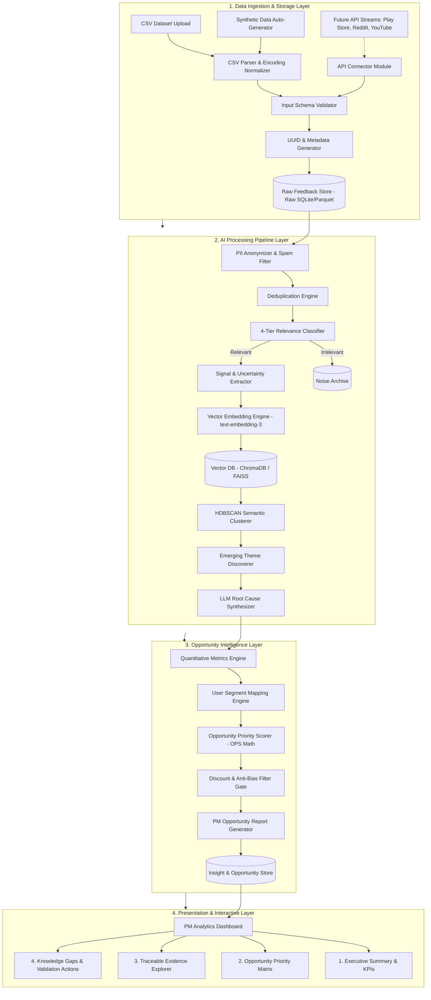
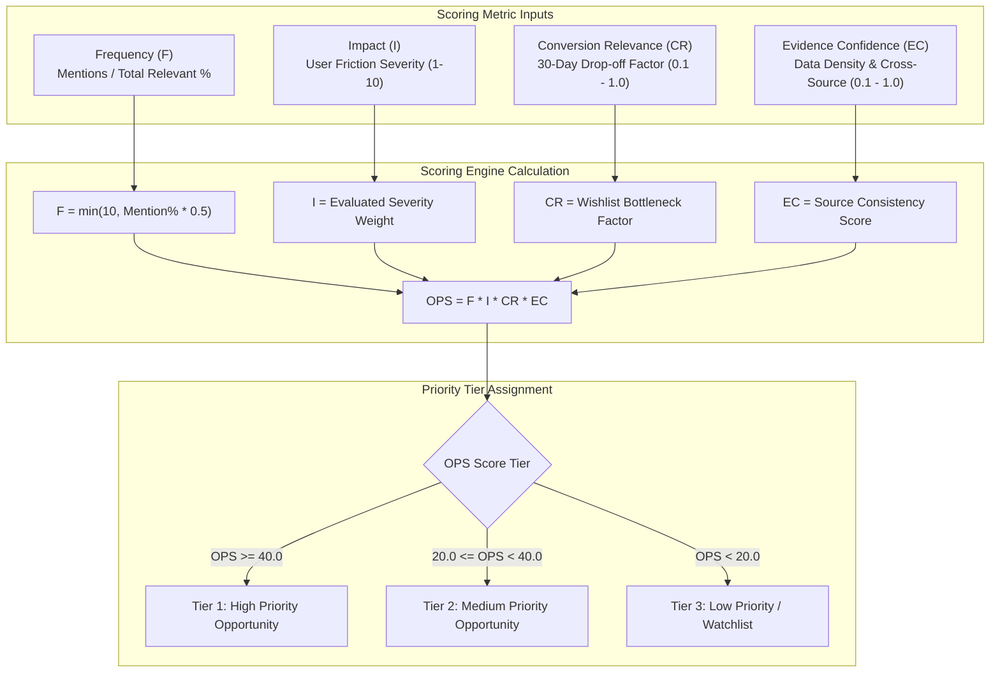
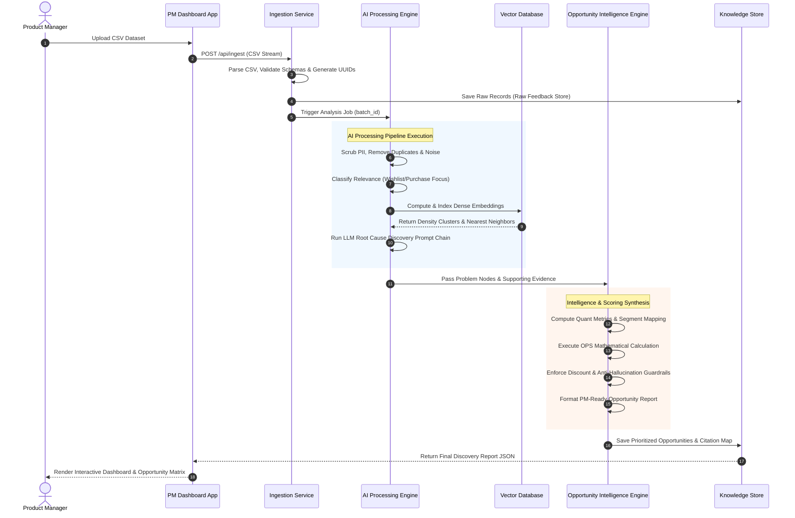
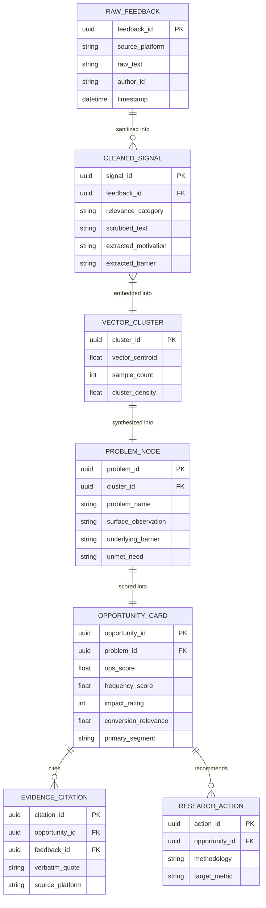
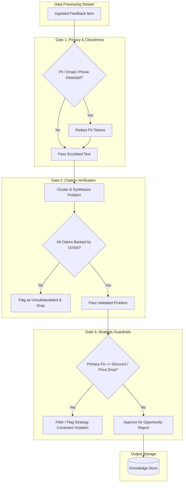
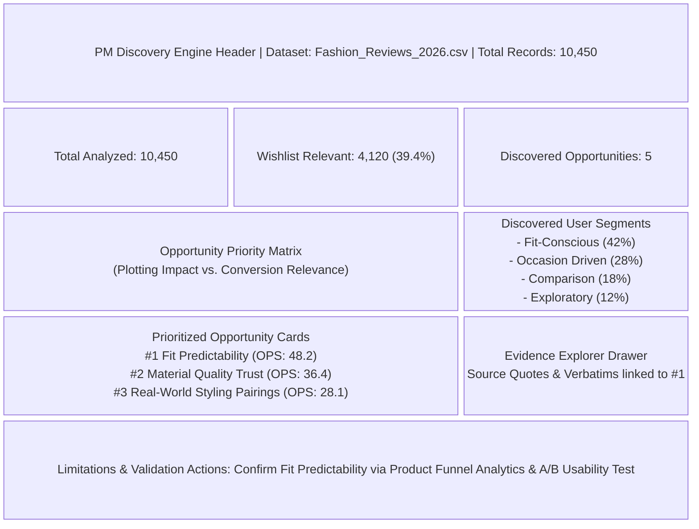

# System Architecture Specification: AI-Powered Wishlist Purchase Discovery Engine

---

## 1. System Overview & Architecture Goals

The **AI-Powered Wishlist Purchase Discovery Engine** processes large volumes of unstructured public feedback (reviews, forum posts, social discussions, Q&A) and transforms them into prioritized, evidence-backed customer conversion opportunities for Product Managers (PMs).

### Key Architectural Goals
1. **End-to-End Traceability:** Every generated insight, problem, or segment maps directly back to raw source feedback items via immutable unique IDs (`feedback_id`).
2. **Decoupled 4-Layer Modular Design:** Ingestion, AI Processing, Scoring Intelligence, and PM Dashboard components are decoupled via strict JSON data contracts, allowing seamless scaling from CSV uploads to real-time API streams.
3. **Determinism & Anti-Hallucination:** Strictly enforced JSON output schemas, confidence scoring, and evidence citation checks eliminate AI hallucinations.
4. **Hybrid Scalability:** Combines fast vector embeddings (HDBSCAN/Cosine clustering) with high-level LLM reasoning for cost-effective, high-throughput root cause discovery.

---

## 2. High-Level Architecture Topology Diagram



---

## 3. Deep-Dive Pipeline & Data Transformation Flow Diagram

```mermaid
flowchart LR
    subgraph Step1["Stage 1: Raw Ingestion"]
        RawText["Raw Customer Comment"]
        RawText --> |UUID & Timestamp| RawRec["Raw Record Object"]
    end

    subgraph Step2["Stage 2: Sanitization & Filtering"]
        RawRec --> |Regex / NER| CleanedText["Scrubbed Text"]
        CleanedText --> |Prompt Classifier| RelStatus{"Relevance Category"}
        RelStatus --> |"Wishlist/Purchase Focus"| RelevantSignal["Relevant Signal"]
    end

    subgraph Step3["Stage 3: Embeddings & Clustering"]
        RelevantSignal --> |Vectorization| DenseVec["Dense Vector (1536-d)"]
        DenseVec --> |HDBSCAN Space| VectorCluster["Dense Vector Cluster Node"]
    end

    subgraph Step4["Stage 4: LLM Synthesis"]
        VectorCluster --> |Prompt Chain| ProblemNode["Structured Problem Node\n(Observation -> Friction -> Need)"]
    end

    subgraph Step5["Stage 5: Scoring & Output"]
        ProblemNode --> |OPS Calculation| OppCard["Prioritized Opportunity Card\n(OPS Score + Citations)"]
    end

    Step1 --> Step2 --> Step3 --> Step4 --> Step5
```



---

## 4. Component Details & Data Contracts

### 4.1 Data Contract: Input Feedback Schema
```json
{
  "$schema": "http://json-schema.org/draft-07/schema#",
  "title": "InputFeedbackRecord",
  "type": "object",
  "properties": {
    "feedback_id": { "type": "string", "format": "uuid" },
    "source_platform": { "type": "string", "enum": ["play_store", "app_store", "reddit", "youtube", "custom_csv"] },
    "raw_text": { "type": "string", "minLength": 1 },
    "author_id": { "type": "string" },
    "timestamp": { "type": "string", "format": "date-time" },
    "rating": { "type": ["number", "null"] },
    "product_category": { "type": ["string", "null"] },
    "url": { "type": ["string", "null"] }
  },
  "required": ["feedback_id", "source_platform", "raw_text", "timestamp"]
}
```

### 4.2 Data Contract: Discovered Problem Node Schema
```json
{
  "problem_id": "PRB-2026-089",
  "problem_name": "Sizing Scale Discrepancy Across Brands",
  "surface_observation": "Users repeatedly mention that size M fits differently depending on the brand.",
  "underlying_barrier": "Lack of standardized real-world fit predictor for multi-brand fashion catalog.",
  "unmet_need": "High-confidence fit predictability prior to purchase commitment.",
  "confidence_level": "HIGH",
  "supporting_feedback_ids": ["fb_1029", "fb_3840", "fb_9921"]
}
```

---

## 5. Opportunity Scoring Architecture & Mathematical Engine

The **Opportunity Priority Score (OPS)** ranks discovered problems based on business value and conversion relevance rather than simple frequency:

$$\text{Opportunity Priority Score (OPS)} = F \times I \times CR \times EC$$



---

## 6. End-to-End Sequence Diagram



---

## 7. Data Model & Traceability ER Diagram



---

## 8. Safety, Privacy & Guardrail Gate Architecture Diagram



---

## 9. PM Analytics Dashboard Visual Wireframe Topology



---

## 10. Implementation Strategy: MVP vs. Target Architecture

| Feature Dimension | MVP Architecture | Full Target Architecture |
| :--- | :--- | :--- |
| **Data Ingestion** | Local CSV File Upload | Multi-channel connectors (Google Play, App Store, Reddit API, YouTube API, Web scrapers) |
| **Pipeline Trigger** | On-demand manual execution | Scheduled cron & real-time webhook streaming |
| **Vector Store** | In-Memory / Local ChromaDB | Production Vector DB (Pinecone / Qdrant / PgVector) |
| **Storage Engine** | SQLite / Local JSON artifacts | PostgreSQL + Redis (Caching Layer) |
| **Clustering Model** | Local HDBSCAN / Agglomerative | Hierarchical Vector Clustering + Dynamic Topic Modeling |
| **LLM Engine** | Structured JSON outputs via OpenAI / Gemini APIs | Multi-agent workflow (LangGraph / AutoGen framework) |
| **User Interface** | Single-page Interactive Dashboard | Enterprise Multi-tenant Dashboard with Export & Jira Integration |

---

## 11. Modular Repository Layout

```
graduation-project/
├── context.md                    # Core problem context & business domain
├── architecture.md               # Complete technical system & diagram specification
├── data/
│   ├── raw/                      # Raw uploaded CSV files
│   └── processed/                # Normalized & scrubbed datasets
├── src/
│   ├── ingestion/                # CSV Parsers, Synthetic Generators & Validators
│   │   ├── synthetic_generator.py
│   │   ├── csv_parser.py
│   │   └── schema_validator.py
│   ├── pipeline/                 # Core AI Processing Pipeline
│   │   ├── cleaner.py
│   │   ├── classifier.py
│   │   ├── extractor.py
│   │   └── clusterer.py
│   ├── intelligence/             # Scoring & Opportunity Synthesis
│   │   ├── root_cause.py
│   │   ├── scorer.py
│   │   └── report_generator.py
│   └── dashboard/                # PM Dashboard Interface
│       └── app.py
└── tests/                        # Automated unit & integration tests
```
