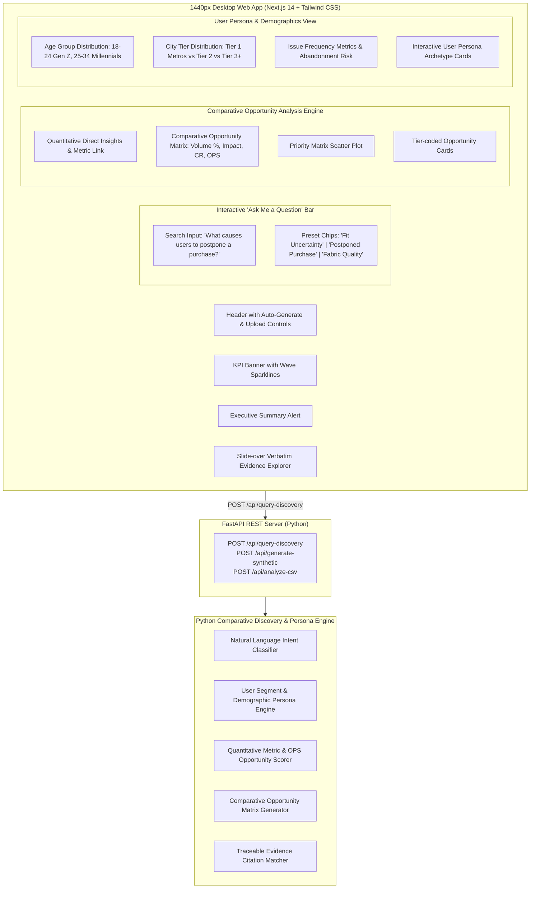

# Implementation Plan: AI-Powered Wishlist Purchase Discovery Engine

Implementation roadmap and execution plan for the **AI-Powered Wishlist Purchase Discovery Engine**, featuring the **Interactive "Ask Me a Question" Discovery Query Engine** and **User Persona & Demographic Analytics**.

---

## User Review Required

> [!IMPORTANT]
> **User Persona & Demographic Analytics Integration**:
> Tracks age group distributions (18-24 Gen Z, 25-34 Millennials, 35-44, 45+), city tier breakdowns (Tier 1 Metros, Tier 2, Tier 3+), issue frequencies (monthly friction rate), and target shopper archetypes across both the Next.js and Streamlit PM dashboards.

> [!TIP]
> **Interactive "Ask Me a Question" Engine**:
> Product Managers can ask natural language questions regarding wishlist drop-offs (e.g., *"What causes users to postpone a purchase?"*, *"Why do fit-conscious shoppers abandon wishlists?"*), receiving quantitative comparative matrices and metric-linked direct answers.

---

## Proposed System Architecture

---

## Detailed Implementation Phases

### Phase 1: Data Ingestion & Demographic Synthetic Data Generation
- **Schema Validation ([schema_validator.py](file:///c:/Users/Teja/OneDrive/Desktop/Next%20leap/Graduation%20project/src/ingestion/schema_validator.py)):** Added `age_group`, `city_tier`, and `issue_frequency` optional fields to `InputFeedbackRecord`.
- **Synthetic Data Generator ([synthetic_generator.py](file:///c:/Users/Teja/OneDrive/Desktop/Next%20leap/Graduation%20project/src/ingestion/synthetic_generator.py)):** Attached realistic demographic distributions (18-24 Gen Z 38%, 25-34 Millennials 44%; Tier 1 45%, Tier 2 38%, Tier 3+ 17%; 2-3 issues/mo 53%, 4+ issues/mo 25%) to generated CSV feedback records.

---

### Phase 2: User Persona & Demographic Analytics Engine
- **Segment & Persona Mapper ([segment_mapper.py](file:///c:/Users/Teja/OneDrive/Desktop/Next%20leap/Graduation%20project/src/intelligence/segment_mapper.py)):** Created `AgeGroupDist`, `CityTierDist`, `IssueFrequencyDist`, `DetailedPersona`, and `PersonaAnalytics` Pydantic models.
- **Report Generator ([report_generator.py](file:///c:/Users/Teja/OneDrive/Desktop/Next%20leap/Graduation%20project/src/intelligence/report_generator.py)):** Integrated `persona_analytics` into `PMDiscoveryReport`.

---

### Phase 3: Interactive "Ask Me a Question" Discovery Engine
- **Comparative Query Engine ([query_engine.py](file:///c:/Users/Teja/OneDrive/Desktop/Next%20leap/Graduation%20project/src/intelligence/query_engine.py)):** Analyzes natural language PM questions, returning comparative opportunity matrices and direct metric insights.
- **FastAPI Endpoints ([main.py](file:///c:/Users/Teja/OneDrive/Desktop/Next%20leap/Graduation%20project/src/api/main.py)):** Exposed `POST /api/query-discovery`, `POST /api/generate-synthetic`, and `POST /api/analyze-csv`.

---

### Phase 4: Next.js 14 Premium UI Dashboard
- **Types Definition ([types/index.ts](file:///c:/Users/Teja/OneDrive/Desktop/Next%20leap/Graduation%20project/frontend/src/types/index.ts)):** Defined TypeScript interfaces for `PersonaAnalytics`, `AgeGroupDist`, `CityTierDist`, `IssueFrequencyDist`, and `DetailedPersona`.
- **User Segments & Personas Component ([UserSegments.tsx](file:///c:/Users/Teja/OneDrive/Desktop/Next%20leap/Graduation%20project/frontend/src/components/UserSegments.tsx)):** Built visual cards for Age Group distribution, City Tier breakdown, Issue Frequency metrics, and 4 detailed User Persona profile cards.

---

### Phase 5: Streamlit PM Analytics Dashboard
- **Streamlit App ([app.py](file:///c:/Users/Teja/OneDrive/Desktop/Next%20leap/Graduation%20project/src/dashboard/app.py)):** Updated Tab 3 with Age Group DataFrames, City Tier charts, Issue Frequency metrics, and User Persona Profiles.

---

### Phase 6: Automated Testing & Verification
- **E2E Integration Test ([test_end_to_end.py](file:///c:/Users/Teja/OneDrive/Desktop/Next%20leap/Graduation%20project/tests/test_end_to_end.py)):** Added unit test assertions verifying `persona_analytics`, age distributions, city tier breakdowns, and persona profiles.
- Verified test suite (`python -m pytest` - 11/11 tests passed).
