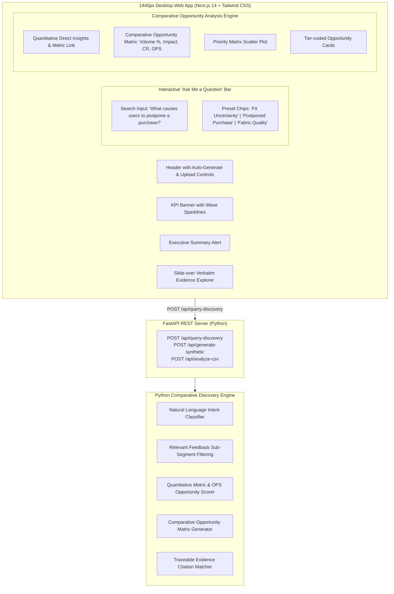

# Implementation Plan: Interactive PM Discovery Engine with 'Ask Me a Question' Query Intelligence

Updating the **AI-Powered Wishlist Purchase Discovery Engine** to match the exact visual design specification from Stitch ([`screen.png`](file:///c:/Users/Teja/OneDrive/Desktop/Next%20leap/Graduation%20project/stitch_myntra_wishlist_discovery_engine/screen.png) and [`DESIGN.md`](file:///c:/Users/Teja/OneDrive/Desktop/Next%20leap/Graduation%20project/stitch_myntra_wishlist_discovery_engine/DESIGN.md)) and introducing the **Interactive "Ask Me a Question" Discovery Query Engine**.

---

## User Review Required

> [!IMPORTANT]
> **New Feature: "Ask Me a Question" Interactive Discovery Engine**:
> Product Managers can ask any natural language question regarding wishlist drop-offs (e.g., *"What causes users to postpone a purchase?"*, *"Why do fit-conscious shoppers abandon wishlists?"*).
> 
> **Beyond Summarization & Sentiment**: The engine goes beyond basic summaries or positive/negative sentiment analysis. It dynamically **identifies**, **quantifies**, and **compares** competing opportunity areas affecting the 30-day wishlist purchase conversion metric.

> [!TIP]
> **Visual Alignment (`screen.png` & `DESIGN.md`)**:
> Includes the exact header layout, top notification & profile icons, glowing wave sparklines on metric cards, 3-tier opportunity cards (`Tier 1 OPS: 48.2`, `Tier 2 OPS: 32.5`, `Tier 3 OPS: 18.9`), and clean 1440px desktop grid.

---

## Proposed System Architecture

---

## Detailed Implementation Phases

### Phase 1: Comparative Query Engine in Backend (`src/intelligence/query_engine.py` & `src/api/main.py`)

#### [NEW] [query_engine.py](file:///c:/Users/Teja/OneDrive/Desktop/Next%20leap/Graduation%20project/src/intelligence/query_engine.py)
- Evaluates PM questions (e.g. *"What causes users to postpone a purchase?"*).
- Filters relevant signals into sub-themes (e.g., *Fit Uncertainty*, *Fabric Doubt*, *Occasion Waiting*, *Photo Mismatch*).
- Computes quantitative metrics for each theme:
  - Mentions & % Share of Query Context
  - Assessed Customer Friction Impact (1-10)
  - 30-Day Conversion Relevance Factor (0.1 - 1.0)
  - Opportunity Priority Score ($\text{OPS} = F \times I \times CR \times EC$)
- Generates a **Comparative Opportunity Analysis**:
  - `query`: Original question asked by PM
  - `direct_answer`: Quantitative summary connecting friction to the 30-day conversion metric
  - `comparative_matrix`: Array comparing identified opportunity areas side-by-side
  - `top_opportunities`: Filtered opportunity cards
  - `evidence_citations`: Traceable customer verbatims with `feedback_id` tags

#### [MODIFY] [main.py](file:///c:/Users/Teja/OneDrive/Desktop/Next%20leap/Graduation%20project/src/api/main.py)
- Expose `POST /api/query-discovery` endpoint accepting `{ "query": "What causes users to postpone a purchase?", "sample_count": 500 }`.

---

### Phase 2: "Ask Me a Question" UI Component (`frontend/src/components/QueryBar.tsx`)

#### [NEW] `QueryBar.tsx`
- Search bar with pink search button and quick preset chips:
  - 🔍 *"What causes users to postpone a purchase?"*
  - 📏 *"Why do fit-conscious shoppers abandon wishlists?"*
  - 🧵 *"What information gaps exist for fabric quality?"*
  - 👗 *"Where do users drop off between wishlist and checkout?"*
- Displays loading state and triggers query analysis via `POST /api/query-discovery`.

---

### Phase 3: Comparative Opportunity Analysis View (`frontend/src/components/ComparativeAnalysisView.tsx`)

#### [NEW] `ComparativeAnalysisView.tsx`
- Renders the quantitative query result:
  - **1. Direct Analytical Answer**: Explaining exact drop-off reasons and metric impacts.
  - **2. Comparative Opportunity Matrix Table**: Side-by-side comparison of opportunity areas showing:
    - Opportunity Name
    - Mention Volume & %
    - Friction Impact (1-10)
    - Conversion Relevance (0.1 - 1.0)
    - Opportunity Priority Score (OPS)
    - Primary Affected Segment
  - **3. Business Goal Impact**: Linking friction directly to 30-day wishlist conversion rate lift.

---

### Phase 4: Visual Design Alignment with `screen.png` & `DESIGN.md`

- Update `KPICards.tsx` to match the exact wave sparklines (Blue, Green, Pink, Gold) shown in [`screen.png`](file:///c:/Users/Teja/OneDrive/Desktop/Next%20leap/Graduation%20project/stitch_myntra_wishlist_discovery_engine/screen.png).
- Update `OpportunityList.tsx` to match `Tier 1 (OPS: 48.2)`, `Tier 2 (OPS: 32.5)`, and `Tier 3 (OPS: 18.9)` styling.
- Add footer: *"© 2024 Myntra Product Discovery Engine. Limited to internal strategic use only."*

---

### Phase 5: Verification & E2E Testing

1. Test query `"What causes users to postpone a purchase?"` via `POST /api/query-discovery` and verify returned comparative matrix.
2. Test UI query input in Next.js and verify comparative matrix table & quote citations render accurately.
3. Run test suite (`pytest tests/`).
